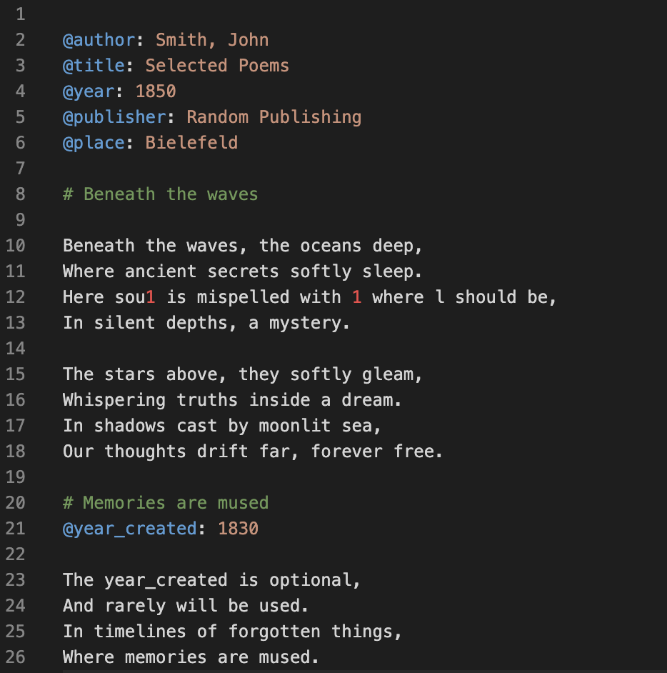
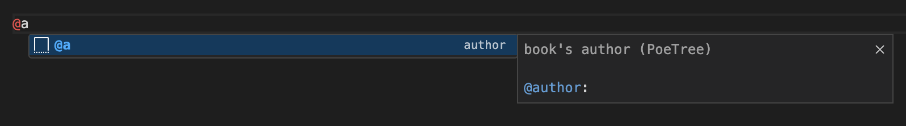
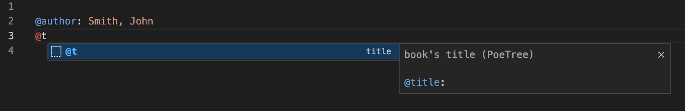

# PoeTree

Extension for [Visual Studio Code](https://code.visualstudio.com/) enabling easier editing of simple source files for [PoeTree project](https://versologie.cz/poetree).

# Features

## Syntax Highlighting

* Colorcoding metadata keys and values (@key: value)
* Highlighting poem titles (# Title)
* Highlighting characters that are not expected in the text of a poem and hence may indicate an OCR error (e.g. numbers, #, $...)

## Snippets

Add metadata keys easier with autocomplete function:
* @a > @author: 
* @t > @title: 
* @y > @year: | @year_created: 
* @p > @publisher: | @place:

